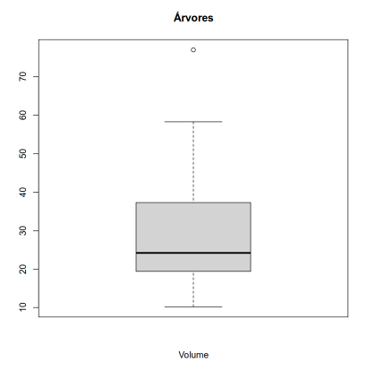

# Visualização de Dados no R: parte II
**autor:** Wellington Moreira


### Introdução

Este material é uma continuação do nosso trabalho anterior: [Visualizando Dados Com R](visualizando-dados-R.md), onde abordamos a prática de gráficos como histogramas, densidade, dispersão, e mais.

Agora abordaremos outros tipos de gráficos básicos, como **boxplots**, **gráficos de barras** e **gráficos de setores (pizza)**, com exemplos detalhados para aplicação prática.


### **1. Boxplot: Resumo de Dados com Quartis**

Um **boxplot** é útil para visualizar a distribuição de uma variável, destacando seus quartis, mediana, e possíveis outliers.

### **Exemplo 1.1: Boxplot básico**

```r
boxplot(trees$Volume, main = "Árvores", xlab = "Volume")

```



**Explicação**:

- O gráfico exibe:
    - Mediana (linha dentro da caixa).
    - Quartis superior e inferior (extremos da caixa).
    - Outliers (pontos fora do "bigode").

### **Exemplo 1.2: Alterando a orientação e cor**

```r
boxplot(trees$Volume,
        main = "Árvores",
        xlab = "Volume",
        col = "blue",
        horizontal = TRUE)

```


**Personalizações**:

- `col`: Define a cor do boxplot.
- `horizontal`: Transforma o gráfico para orientação horizontal.

### **Exemplo 1.3: Removendo outliers**

```r
boxplot(trees$Volume,
        main = "Árvores",
        xlab = "Volume",
        col = "blue",
        outline = FALSE)

```


**Explicação**:

- `outline = FALSE`: Remove os pontos que representam outliers.

### **Exemplo 1.4: Notch para intervalo de confiança**

```r
boxplot(trees$Height,
        main = "Árvores",
        xlab = "Altura",
        col = "blue",
        notch = TRUE)

```


**Explicação**:

- `notch`: Adiciona uma "curvatura" para representar o intervalo de confiança da mediana.

### **Exemplo 1.5: Inspecionando dados de um boxplot**

```r
# Estatísticas do boxplot
boxplot.stats(trees$Height)
```


```r
# Apenas os valores principais (mínimo, Q1, mediana, Q3, máximo)
boxplot.stats(trees$Height)$stats

# saída: 63 72 76 80 87
```

**Explicação**:

- `boxplot.stats`: Retorna as estatísticas do boxplot, incluindo limites e outliers.

### **Exemplo 1.6: Boxplot para múltiplas variáveis**

```r
boxplot(trees, main = "Distribuição de Variáveis das Árvores")

```


**Explicação**:

- Quando aplicado a um dataframe, cria um boxplot para cada variável numérica.

---

### **2. Gráfico de Barras**

Gráficos de barras são usados para comparar valores categóricos.

### **Exemplo 2.1: Preparação dos dados**

```r
# Agregando os dados do conjunto InsectSprays
spray <- aggregate(. ~ spray, data = InsectSprays, sum)
spray

```

**Explicação**:

- `aggregate`: Agrupa os dados e calcula o total para cada categoria de spray.

### **Exemplo 2.2: Criando um gráfico de barras**

```r
# Gráfico de barras
barplot(spray$count,
        col = gray.colors(6),
        xlab = "Spray",
        ylab = "Total",
        names.arg = spray$spray)
# Adicionando bordas
box()

```


**Personalizações**:

- `col`: Define uma escala de cores em tons de cinza.
- `names.arg`: Define os rótulos das barras.

---

### **3. Gráfico de Setores (Pizza)**

Gráficos de setores mostram proporções relativas de categorias.

### **Exemplo 3.1: Pizza básica**

```r
pie(spray$count,
    labels = spray$spray,
    main = "Distribuição de Sprays",
    col = c(1:6))

```


**Explicação**:

- `labels`: Define os rótulos para cada fatia.
- `col`: Define as cores de cada setor (1:6 usa cores padrões do R).

### **Exemplo 3.2: Pizza com legenda**

```r
# Criando gráfico sem rótulos
pie(spray$count,
    labels = NA,
    main = "Distribuição de Sprays",
    col = c(1:6))
# Adicionando legenda
legend("bottomright",
       legend = spray$spray,
       fill = c(1:6))

```


**Explicação**:

- Remove rótulos diretamente no gráfico (`labels = NA`).
- Adiciona uma legenda ao lado, com as cores e categorias correspondentes.

---

### **Resumo**

1. **Boxplots**:
    - Úteis para identificar outliers e entender a distribuição de dados.
    - Podem ser personalizados para orientação, cores e remoção de outliers.
2. **Gráficos de Barras**:
    - Mostram comparações entre categorias.
    - Requerem preparação de dados com agregação.
3. **Gráficos de Pizza**:
    - Ideais para proporções e distribuições.
    - Complementados com legendas para maior clareza.

Esses gráficos ampliam as possibilidades de análise e visualização no R, sendo indispensáveis para um analista de dados!