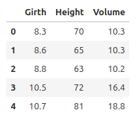

# Visualizando dados com Python

Neste material de estudo, vamos aprender a criar gráficos em Python utilizando as bibliotecas **Pandas**, **Matplotlib** e **Seaborn**. A ideia é começar com conceitos básicos e, à medida que avançamos, introduzir técnicas mais avançadas, como o uso do parâmetro **KDE** em histogramas. Vamos utilizar o **dataset `trees`**, que é um conjunto de dados com informações sobre árvores, para ilustrar os exemplos.

### Estrutura do Estudo

1. **Introdução ao Pandas** para manipulação de dados e gráficos.
2. **Introdução ao Matplotlib** para plotagem básica.
3. **Introdução ao Seaborn** para gráficos estatísticos avançados.
4. **Histograma com KDE**: visualizando a distribuição dos dados.


### 1. **Introdução ao Pandas**

O **Pandas** é uma das bibliotecas mais importantes para manipulação e análise de dados em Python. Além disso, ele permite a criação de gráficos de maneira fácil e rápida utilizando o método `.plot()` diretamente sobre DataFrames.

### Exemplo de Carregamento do Dataset com Pandas:

```python
import pandas as pd
import seaborn as sns

# carregar o dataset 'trees' 
df = pd.read_csv('../datasets/trees.csv', sep=',', encoding='utf-8')

# primeiras linhas do dataset
df.head()

```



Esse comando carrega os dados e imprime as primeiras linhas. O dataset contém as colunas:

- **Height**: altura da árvore (em metros).
- **Girth**: diâmetro do tronco (em polegadas).
- **Volume**: volume da árvore (em pés cúbicos).

### Criando um histograma com Pandas

```python
df.iloc[:, 1].hist(bins=6)
```


Neste comando acessamos todos os registros da coluna de índice 1 e invocamos o método `hist` que faz o plot de histograma desses registros. onde o parâmetro `bins` para intervalar as frequências.  

### Avançando com Pandas

O Pandas integra a funcionalidade de plotagem diretamente com Matplotlib. Aqui está um exemplo de como fazer isso com um histograma básico.

```python
df['Height'].plot(kind='hist', bins=10, alpha=0.7, color='skyblue', edgecolor='black')
plt.title('Distribuição das Alturas das Árvores')
plt.xlabel('Altura (metros)')
plt.ylabel('Frequência')
plt.show()
```


Esse gráfico mostra um histograma simples das alturas das árvores, onde o eixo x representa a altura e o eixo y representa a frequência.

### 2. **Introdução ao Matplotlib**

O **Matplotlib** é uma biblioteca de plotagem poderosa, sendo a base para muitas outras bibliotecas de visualização, como o Seaborn. Ela permite criar uma ampla gama de gráficos de forma flexível.

### Criando um Histograma Básico com Matplotlib:

```python
plt.hist(df['Height'], bins=6)
plt.title('Distribuição de Frequência')
plt.xlabel('Altura')
plt.ylabel('Frequência')
plt.show()
```


Esse gráfico assim como o anterior feito com o Pandas, mostra a distribuição dos dados do atributo ‘Altura’ das Árvores. 

### 3. **Introdução ao Seaborn**

O **Seaborn** é uma biblioteca de visualização baseada no Matplotlib, mas oferece uma interface mais fácil de usar para gráficos estatísticos. Ele facilita a criação de gráficos complexos com menos código e automaticamente lida com aspectos estéticos.

### Histograma com Seaborn:

```python
sns.histplot(data=df['Height'], bins=6).set_title('Distribuição de Frequência')
plt.xlabel('Altura')
plt.ylabel('Frequência')
plt.show()

```


Seaborn também oferece diversas funções para gráficos estatísticos como boxplots, violin plots, etc.

### 4. **Histograma com KDE**

Agora, vamos explorar os **histogramas** com o parâmetro **KDE** (Kernel Density Estimation), que ajuda a visualizar a distribuição dos dados de forma mais suave. O KDE estima a densidade de probabilidade dos dados, oferecendo uma representação mais contínua da distribuição.

### Histograma com KDE usando Seaborn:

Agora, vamos adicionar o parâmetro **KDE** ao histograma para suavizar a distribuição:

```python
sns.histplot(data['Height'], kde=True)
plt.title('Distribuição das Alturas das Árvores com KDE')
plt.xlabel('Altura (metros)')
plt.ylabel('Frequência')
plt.show()
```


Ao usar **kde=True**, o Seaborn plota uma curva suave que representa a estimativa de densidade dos dados. Isso é útil para entender melhor a forma da distribuição, especialmente em conjuntos de dados com muitos valores contínuos.

### Histograma com KDE e Ajuste de Parâmetros:

Você pode ajustar o comportamento do KDE modificando o parâmetro `kde_kws={'bw_adjust'}`, que controla a suavização da curva. Um valor maior suaviza mais a curva, enquanto um valor menor torna a curva mais sensível às flutuações nos dados.

```python
sns.histplot(data['Height'], kde=True, kde_kws={'bw_adjust':0.5})
plt.title('Distribuição das Alturas das Árvores com KDE (bw_adjust=0.5)')
plt.xlabel('Altura (metros)')
plt.ylabel('Frequência')
plt.show()
```


### Revisão

Neste estudo, cobrimos:

1. **Manipulação de Dados com Pandas**: Como carregar e visualizar o dataset `trees`.
2. **Gráficos com Pandas**: Como criar gráficos diretamente de um DataFrame com o método `.plot()`.
3. **Criação de Gráficos Básicos com Matplotlib**: Como criar gráfico simples de Histograma.
4. **Gráficos Estatísticos Avançados com Seaborn**: Como criar gráfico de histograma.
5. **Histograma com KDE**: Como visualizar a distribuição dos dados de maneira suave usando o parâmetro **KDE**.

E assim utilizamos ferramentas fundamentais para explorar e visualizar dados de maneira eficiente em Python. O uso combinado dessas bibliotecas permite criar visualizações poderosas e informativas para análise de dados.