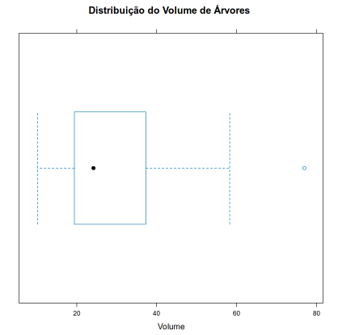

# Visualização de dados com Lattice

# Explorando o Pacote Lattice: Visualizações Avançadas com R

Quando se trata de criar visualizações mais sofisticadas e flexíveis no R, o pacote **Lattice** é uma excelente escolha. Ele permite construir gráficos condicionais, matrizes de dispersão e até gráficos 3D com facilidade. Embora já venha incluído no R, o pacote precisa ser carregado antes do uso. Vamos explorar suas funcionalidades com exemplos práticos que refletem desafios comuns na análise de dados.

---

## **Carregando o Pacote Lattice**

Antes de começar, o pacote Lattice precisa ser ativado com o comando:

```r
library(lattice)

```

Agora, vamos explorar algumas das suas funcionalidades principais.

---

## **1. Boxplots com Lattice**

Os Boxplots no Lattice são semelhantes aos gráficos padrão do R, mas trazem um estilo mais limpo e personalizável.

### **Exemplo Prático: Análise de Volume de Árvores**

Para analisar a distribuição do volume de árvores:

```r
bwplot(trees$Volume, main="Distribuição do Volume de Árvores", xlab="Volume")

```

Este gráfico apresenta a mediana como um ponto e usa linhas pontilhadas para marcar os limites dos quartis, o que pode ser visualmente mais atraente em alguns casos.



Embora o Boxplot seja ótimo para entender distribuições, o histograma é mais adequado para visualizar frequências. Vamos explorar o histograma do Lattice.

---

## **2. Histogramas com Lattice**

Os histogramas do Lattice oferecem maior controle sobre parâmetros como proporção, número de quebras e tipo de contagem.

### **Exemplo Prático: Análise de Volume de Árvores**

Para criar um histograma do volume das árvores com proporções relativas:

```r
histogram(trees$Volume, main="Distribuição do Volume de Árvores", xlab="Volume", aspect=1, type="percent", nint=5)

```


Aqui:

- **`aspect`** ajusta a proporção do gráfico.
- **`nint`** define o número de intervalos (bins).
- **`type`** determina a métrica (percentual, contagem ou densidade).

### **Histogramas Condicionais**

E se quisermos analisar o peso de galinhas condicionados à alimentação? Podemos usar:

```r
histogram(~weight | feed, data=chickwts, main="Peso Condicionado à Alimentação", xlab="Peso")

```


Esse gráfico divide os dados em grupos baseados no tipo de alimentação, facilitando a comparação entre as distribuições.

Os histogramas condicionais são ótimos para análises detalhadas, mas e se quisermos explorar relações entre variáveis? Vamos usar gráficos de dispersão condicionais.

---

## **3. Gráficos de Dispersão Condicionais**

Gráficos de dispersão condicionais ajudam a visualizar relações entre variáveis numéricas em diferentes grupos.

### **Exemplo Prático: Concentração e Captação de CO2**

Usando o conjunto de dados `CO2`, podemos explorar a relação entre concentração e captação de CO2:

```r
xyplot(CO2$conc ~ CO2$uptake | CO2$Type, main="Concentração vs Captação de CO2 por Tipo", xlab="Captação de CO2", ylab="Concentração de CO2")

```


Aqui, os gráficos são divididos pelo tipo de planta (`Type`), permitindo comparar padrões entre grupos.

### **Gráficos de Dispersão com Outra Condição**

Podemos adicionar mais um nível de detalhe, como comparar plantas refrigeradas e não refrigeradas:

```r
xyplot(CO2$conc ~ CO2$uptake | CO2$Treatment, main="Concentração vs Captação de CO2 por Tratamento")

```


Além de gráficos de dispersão, o Lattice suporta matrizes de dispersão para explorar múltiplas variáveis simultaneamente.

---

## **4. Matrizes de Dispersão**

As matrizes de dispersão permitem analisar relações entre várias variáveis numéricas de uma só vez.

### **Exemplo Prático: Variáveis de CO2**

Para explorar múltiplas variáveis no conjunto de dados `CO2`:

```r
splom(~CO2[4:5] | CO2$Type, main="Matriz de Dispersão por Tipo de Planta")

```


Este gráfico é especialmente útil para identificar padrões multivariados e diferenças entre categorias.

Quando precisamos visualizar distribuições de densidade com condições, os gráficos de densidade do Lattice são ideais.

---

## **5. Gráficos de Densidade**

Os gráficos de densidade são uma forma elegante de representar distribuições contínuas.

### **Exemplo Prático: Distribuição de Concentração de CO2**

Podemos visualizar a densidade da concentração de CO2 condicionada ao tratamento:

```r
densityplot(~CO2$conc | CO2$Treatment, plot.points=FALSE, main="Densidade da Concentração de CO2 por Tratamento")

```


O parâmetro `plot.points=FALSE` remove pontos individuais, destacando apenas as curvas de densidade.

Se quisermos explorar gráficos em 3D ou criar gráficos mais sofisticados, o Lattice oferece suporte integrado.

---

## **6. Gráficos 3D**

Gráficos tridimensionais são úteis para explorar relações entre três variáveis.

### **Exemplo Prático: Sprays para Abelhas**

Usando o conjunto de dados `OrchardSprays`, podemos visualizar o impacto de sprays repelentes:

```r
cloud(decrease ~ rowpos * colpos, groups=treatment, data=OrchardSprays, main="Impacto de Sprays em Abelhas")

```


Os pontos são coloridos com base no tipo de tratamento, adicionando uma dimensão categórica à análise.

O Lattice também suporta gráficos específicos como o **level plot**, que destacam relações com uso de cores.

---

## **7. Level Plot**

O level plot usa cores para representar uma terceira variável, facilitando a visualização de relações complexas.

### **Exemplo Prático: Análise de Árvores**

Para analisar a relação entre circunferência, altura e volume das árvores:

```r
levelplot(Girth ~ Height * Volume, data=trees, main="Relação entre Circunferência, Altura e Volume")

```


A cor indica a circunferência, ajudando a identificar correlações visuais.

---

## Encerramento e considerações finais

O pacote Lattice oferece uma ampla gama de opções para criar gráficos avançados e detalhados no R. Com funcionalidades como gráficos condicionais, 3D e level plots, ele permite explorar dados de maneira profunda e visualmente rica.

Aplique essas ferramentas nos seus projetos para transformar dados em insights visuais claros e impactantes.